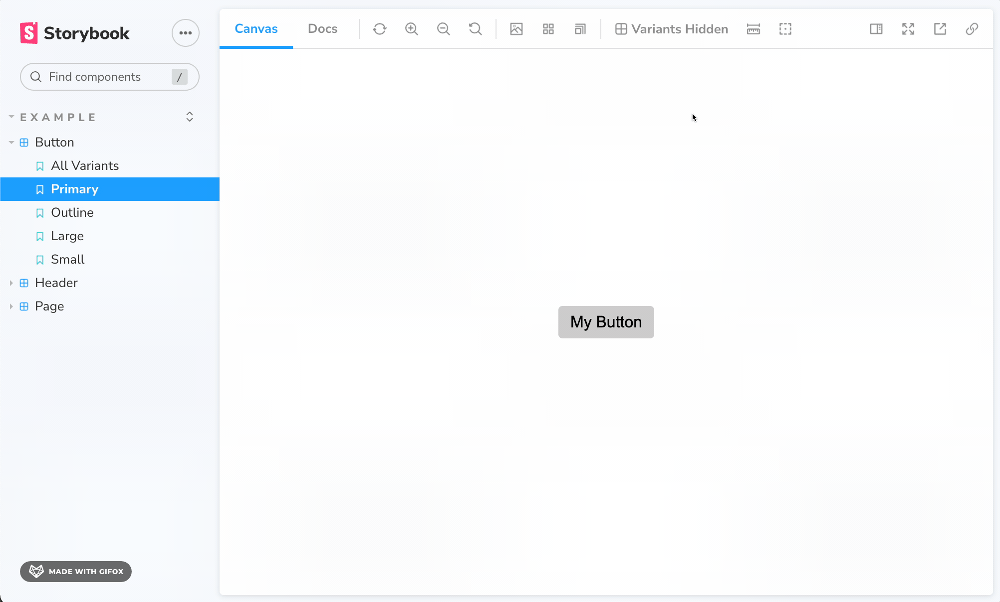

<p align="center">
  <br />
  
  <br />
  <br />
</p>

# Storybook Variants Addon

Show all variants of a component in a grid

- 📦 No extra code required for creating variants.
- 📝 Editing from Controls table and editor re-renders all variants.

## Getting Started

#### First install it

```sh
npm install storybook-addon-variants
```

#### Register the addon in your main.js file

```js
// .storybook/main.js

module.exports = {
  stories: [...],
  addons: ["storybook-addon-variants"],
};
```

#### Enable your component variants

There are two ways to do so:

1. By using the toolbar button:



2. By defining a parameter in your story:

```js
// /MyComponent.stories.js

// ...rest of code omitted for brevity

// CSF2 syntax example
export const MyStory = Template.bind({})
MyStory.parameters = {
  variants: {
    enable: true
  }
};

// or CSF3 syntax example
export const MyStory = {
  parameters: {
    variants: {
      enable: true
    }
  }
};
```

By defining this parameter, this story will _always_ render with all variants, regardless of what you select in the toolbar.

This method is quite useful if you want to have a fixed story that shows all variants in your sidebar. It's particularly useful for visual regression testing, when you want to take snapshots of all variants at once with tools like [Chromatic](https://www.chromatic.com/).
